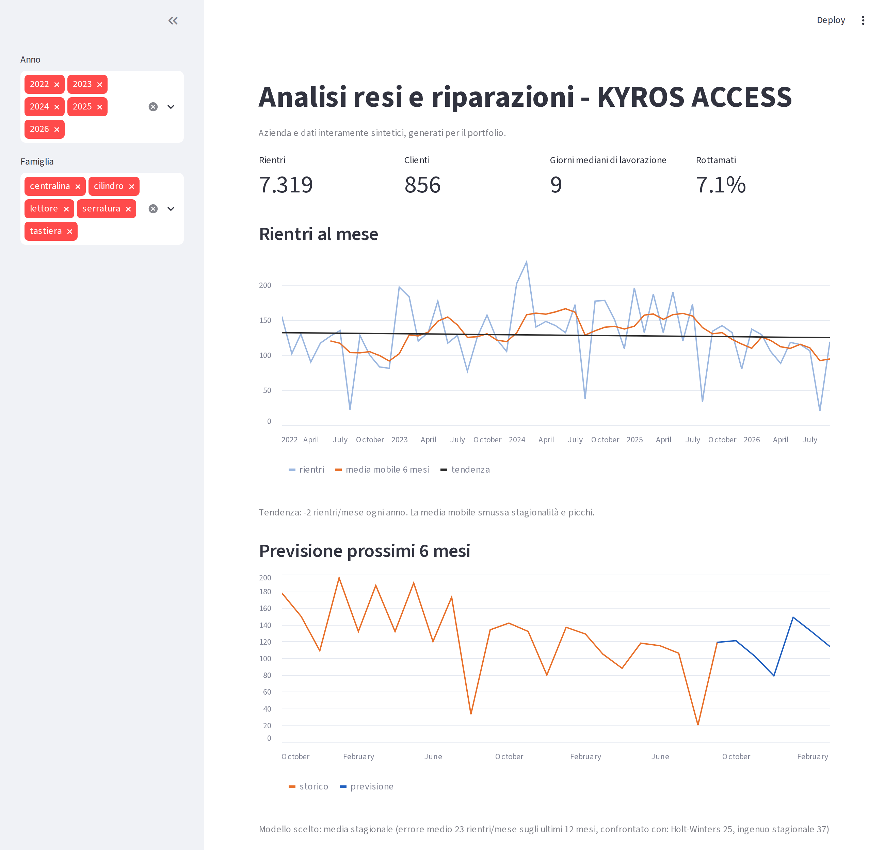

# Document AI — schede di riparazione compilate a mano

Estrazione automatica dei dati da schede di riparazione **scansionate e compilate a mano** (fronte e retro),
con un modello vision-language **gratuito e locale** (Qwen2.5-VL-7B su GPU Kaggle T4) e un'accuratezza
**misurata campo per campo**.

Il progetto nasce da un caso reale (gestione resi e riparazioni di un produttore di sistemi di accesso).
Per pubblicarlo senza esporre documenti, clienti o codici reali, tutto quello che è nel repository è **sintetico**:
l'azienda *KYROS ACCESS* è fittizia e le schede sono generate. I documenti reali sono usati solo in privato.

## Il problema
Ogni scheda ha una parte stampata (numero riparazione, cliente, articolo, date) e una parte scritta a mano da tecnici diversi:
seriale, tempo di riparazione, firmware, una tabella di componenti sostituiti (codice, descrizione, intervento, causa, pezzi)
con "idem" scritti come `n` o virgolette, e note libere sul retro. Grafie diverse, stampatello irregolare, 4 "aperti", 7 con la stanghetta.

## 1. Generatore di schede sintetiche realistiche
`generator/genera_schede.py` produce PDF di 2 pagine + la **verità** in JSON.
La scrittura a mano non usa font: è composta con **inchiostro vero**, parole e caratteri ritagliati da ~260 schede reali
(1.530 ritagli trascritti, 482 parole, glifi per quasi tutto l'alfabeto e le cifre), con effetto scansione (rotazione, rumore, JPEG).
La raccolta dei ritagli resta privata e non è nel repository.

## 2. Pipeline di estrazione
1. **Lettura della pagina intera** (`esegui_qwen.py`): Qwen2.5-VL-7B legge fronte e retro e restituisce un JSON con schema fisso (`prompt.py`).
2. **Riparazione del JSON** (`ripara_json.py`) quando il modello sbaglia la sintassi.
3. **Correzione con il catalogo** (`correggi.py`): separa causa e intervento, risolve gli idem e aggancia codice + descrizione
   alla voce di catalogo più vicina a entrambe le letture (nel mondo reale il catalogo ricambi è nel gestionale).
4. **Seconda lettura mirata** (`esegui_campi.py` + `unisci_campi.py`): i campi liberi (seriale, date, tempo, firmware) vengono ritagliati,
   ingranditi e riletti due volte; si vota fra le tre letture scartando quelle che violano il formato.
   **Se le letture non coincidono il campo viene segnalato come incerto** e va a revisione umana.
5. **Valutazione** (`valuta.py`): accuratezza per campo, schede perfette, errori intercettati dalla segnalazione.

## Risultati (100 schede sintetiche di test, Qwen2.5-VL-7B, ~65 s/scheda su Kaggle T4, costo 0)

| | Solo modello | + catalogo | + seconda lettura |
|---|---|---|---|
| Campi stampati | 100% | 100% | 100% |
| Campi scritti a mano | 56% | 84% | **85%** |
| Codice componente | 23% | 95% | **95%** |
| Intervento / causa | 14% / 41% | 89% / 74% | **89% / 74%** |
| Data produzione / eseguito il | 61% / 81% | = | **73% / 85%** |
| Firmware | 82% | = | **87%** |
| Seriale | 28% | = | **32%** |
| Parole delle note ritrovate | 72% | = | **72%** |
| **Errori segnalati come incerti** | 8% | 29% | **70%** |

**Lettura dei risultati.** Lo stampato è risolto. Dove esiste un vocabolario chiuso (catalogo) l'errore di lettura si recupera quasi tutto.
I campi numerici liberi scritti a mano (il seriale soprattutto) restano il limite di un modello 7B: la risposta del sistema è
**sapere quando non sa**. Con la segnalazione, 7 errori su 10 vengono indirizzati a un controllo umano, invece di finire nel database.

### Confronto con modelli a pagamento (Claude via API, stesse 100 schede, stesso prompt e stessa valutazione)

| | **Qwen2.5-VL-7B + pipeline** | Claude Haiku 4.5 + catalogo | Claude Sonnet 5 + catalogo |
|---|---|---|---|
| Costo per 100 schede | **$0** (GPU gratuita Kaggle) | $0,60 | $2,25 |
| Secondi per scheda | 55 | **4** | 8 |
| Campi stampati | **100%** | **100%** | 98% |
| Campi scritti a mano | 85% | 75% | **86%** |
| Codice componente | **95%** | 83% | 89% |
| Seriale | 32% | 3% | **40%** |
| Parole delle note ritrovate | 72% | 52% | **92%** |
| Schede perfette | 7 | 0 | **22** |
| **Errori segnalati come incerti** | **70%** | 54% | 33% |

Sonnet 5 è il lettore migliore (soprattutto sul testo libero delle note), a circa 2 centesimi a scheda; su 2 schede su 100
non ha prodotto il JSON (contate come errate). Il modello gratuito da 7B, con catalogo, seconda lettura e voto a maggioranza,
lo eguaglia sui campi scritti a mano e intercetta il doppio degli errori. Predizioni e report in `risultati/confronto_claude/`,
script in `estrazione/esegui_claude.py`. Prossimo passo: fine-tuning di Qwen sulle schede sintetiche.

## Limiti e prossimi passi
- Numeri misurati su schede sintetiche. La pipeline è stata validata in privato su un campione di schede reali (non pubblicabili): stampati letti al 100%; sulla parte a mano, quando due modelli gratuiti (Qwen2.5-VL-7B e Qwen3-VL-8B) concordano la lettura è quasi sempre corretta, e il disaccordo diventa il segnale per il controllo umano.
- Seriale: resta difficile per tutti i modelli (max 40%): prossimo passo fine-tuning su schede sintetiche o OCR di sole cifre sul ritaglio.
- La segnalazione è ancora prudente (molti campi corretti segnalati): da calibrare.

## 3. Analisi dei resi e previsione

🔗 **Demo online:** https://kyros-resi-dashboard.streamlit.app/

Una volta estratte, le schede finiscono in un database. `analisi/` lavora su un database **sintetico** di ~7.400 rientri
(2022-2026) che imita la forma di un archivio reale: stagionalità (agosto chiuso), pochi clienti che pesano molto,
tempi di lavorazione, esiti e anche gli **errori tipici dell'inserimento manuale**.

- `genera_db.py` crea il database SQLite (clienti, articoli, rientri, pezzi sostituiti).
- `analisi.py` pulisce i dati e produce il report: righe copiate due volte, esiti scritti male ("speditp"),
  date impossibili (arrivo nel futuro, chiusura prima dell'arrivo), mesi finali non ancora caricati.
- `previsione.py` prevede i rientri dei prossimi 6 mesi. Tre modelli (ingenuo stagionale, media stagionale,
  Holt-Winters) sono confrontati su un backtest onesto: ogni mese degli ultimi 12 previsto con i soli dati precedenti.
  Vince il più accurato; errore medio ~23 rientri/mese (~18%).
- `app.py` è la dashboard Streamlit con filtri per anno e famiglia di prodotto.

Stessa pipeline eseguita in privato sull'archivio reale: i numeri chiave hanno lo stesso ordine di grandezza e la
pulizia ha trovato problemi veri (date nel futuro, chiusure prima dell'arrivo, mesi non aggiornati).
Una lezione utile: righe "identiche" non sono sempre doppioni — pezzi uguali dello stesso reso hanno ciascuno la
propria scheda, quindi il numero di scheda fa parte della chiave.



## Struttura
```
generator/    genera_schede.py, inchiostro_reale.py, mano_tratti.py
estrazione/   prompt.py, schema.py, esegui_qwen.py, esegui_campi.py, ripara_json.py, correggi.py, unisci_campi.py, valuta.py, catalogo.json
risultati/    report JSON delle tre fasi
analisi/      genera_db.py, analisi.py, previsione.py, app.py, report/
```
