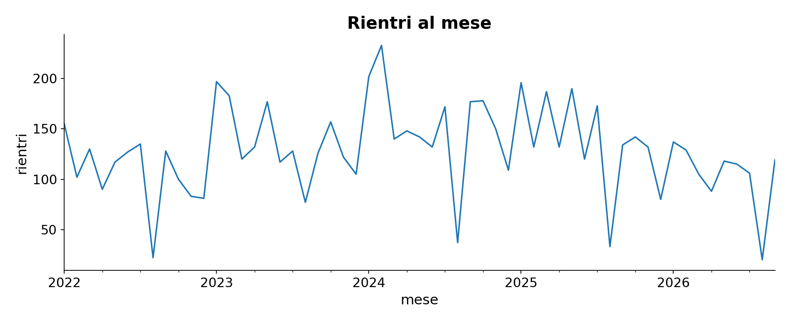
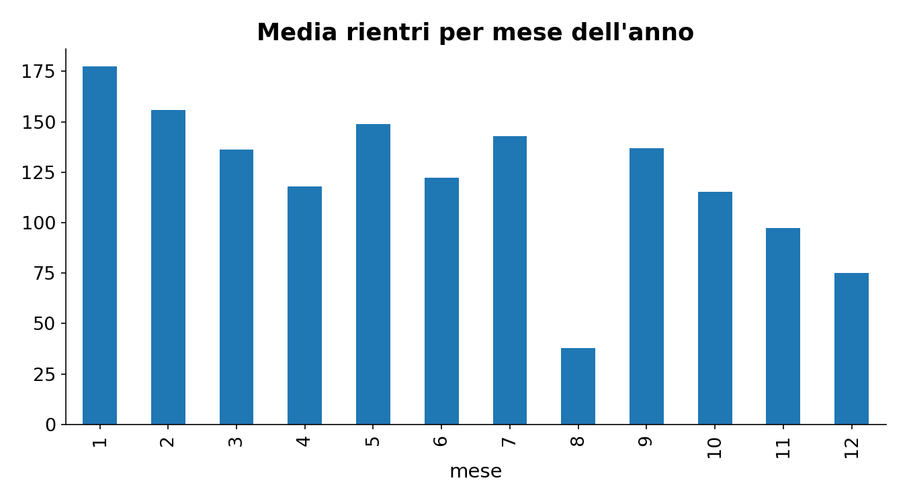
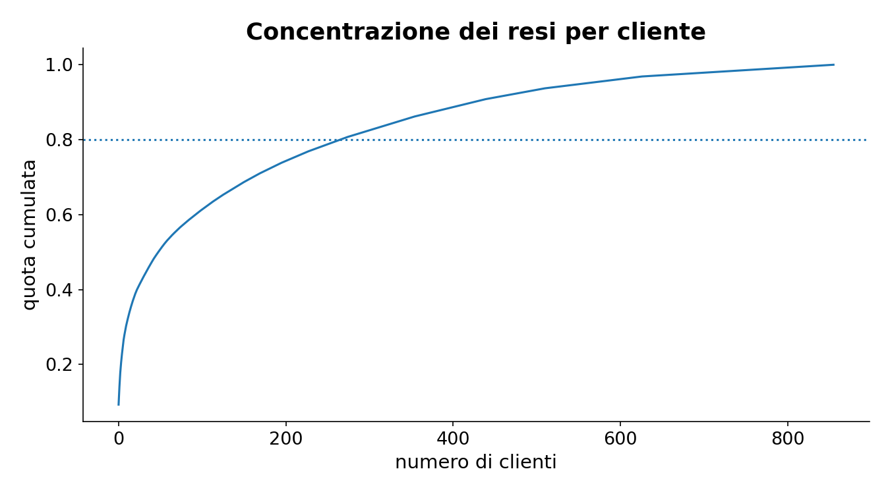
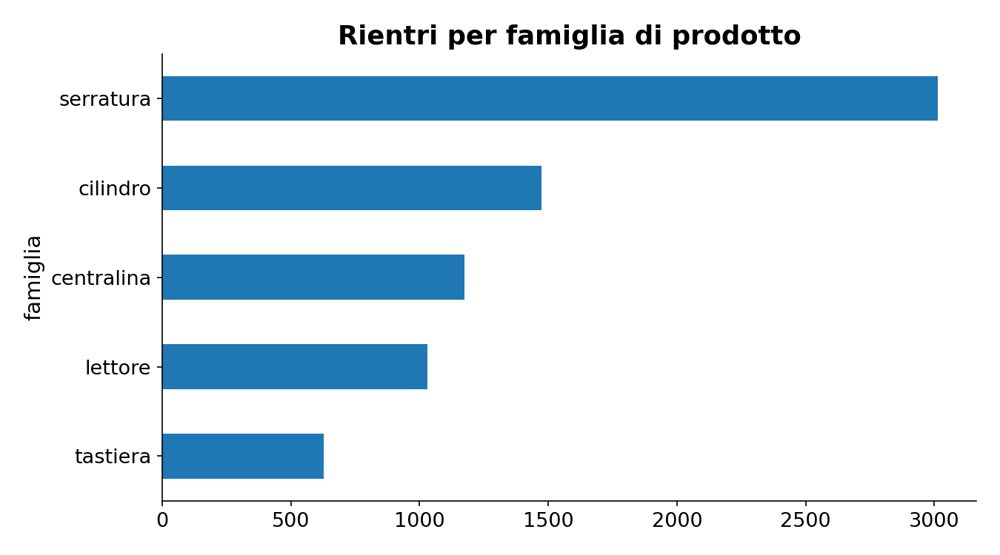
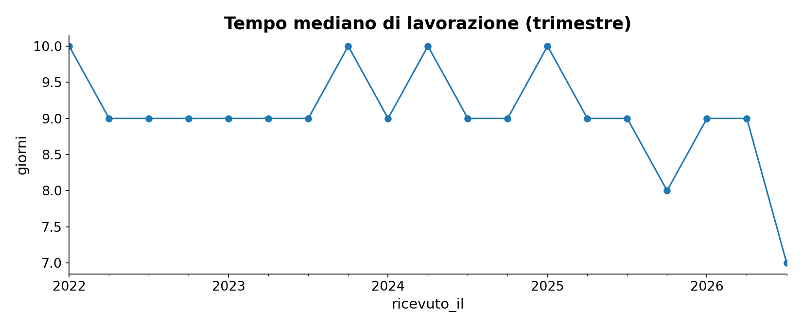
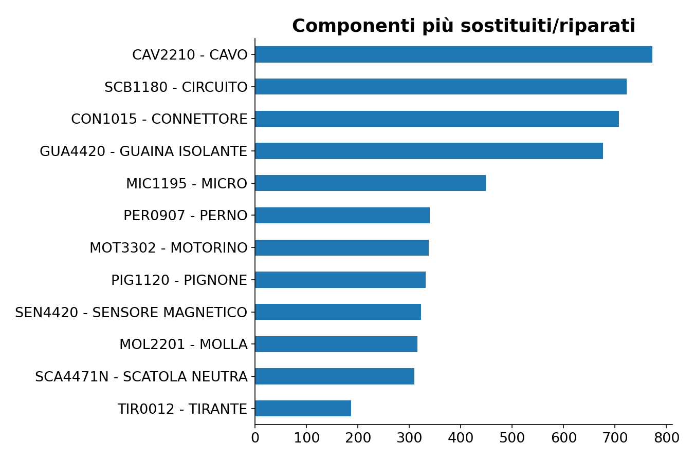
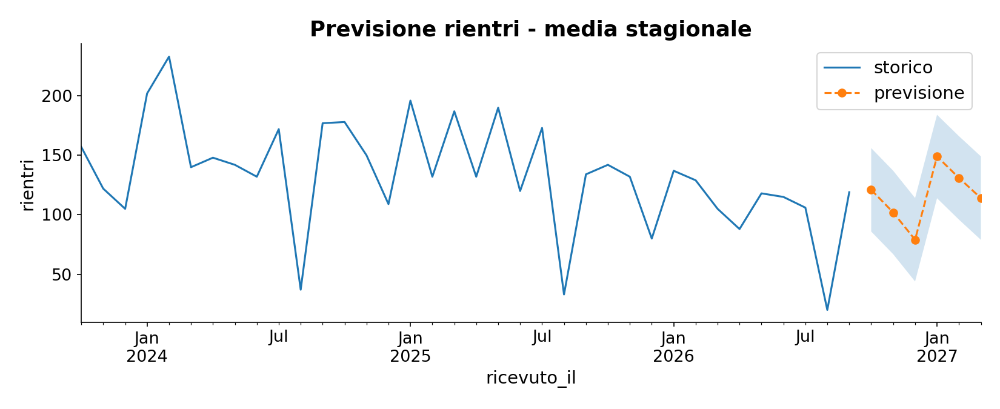

# Analisi resi - KYROS ACCESS (dati sintetici)

## Qualità dei dati
- righe copiate due volte (stessa scheda): **108**
- date di arrivo nel futuro (scartate): **0**
- esiti scritti male: **91**
- date di consegna precedenti all'arrivo: **71**
- quantita' zero: **96**
- chiusure precedenti all'arrivo: **0**

## Numeri chiave
- rientri (dopo pulizia): **7319**, clienti: **856**, articoli: **298**
- i 10 clienti principali generano il **30%** dei resi
- tempo mediano di lavorazione: **9 giorni** (aperti: 359)
- esiti: spedito 81%, mpf 9%, rottamato 7%, sostituito 2%, reso a cliente 1%

## Per famiglia

| famiglia   |   rientri |   giorni_mediani |   rottamati |
|:-----------|----------:|-----------------:|------------:|
| centralina |      1175 |               12 |         3.3 |
| cilindro   |      1473 |                8 |         3.8 |
| lettore    |      1030 |                9 |         4.1 |
| serratura  |      3014 |                9 |        11.9 |
| tastiera   |       627 |                9 |         3.2 |

## Grafici

## Previsione rientri (prossimi 6 mesi)
Errore medio assoluto sugli ultimi 12 mesi (rientri/mese):
- media stagionale: **23.4**
- Holt-Winters: **25.3**
- ingenuo stagionale: **36.9**

|         |   rientri previsti |
|:--------|-------------------:|
| 10/2026 |                121 |
| 11/2026 |                102 |
| 12/2026 |                 79 |
| 01/2027 |                149 |
| 02/2027 |                131 |
| 03/2027 |                114 |

